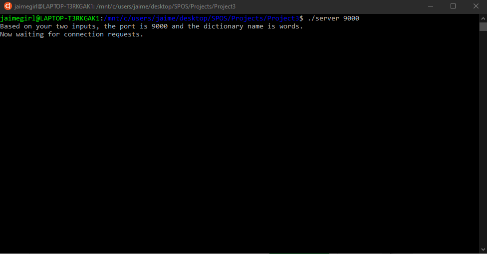
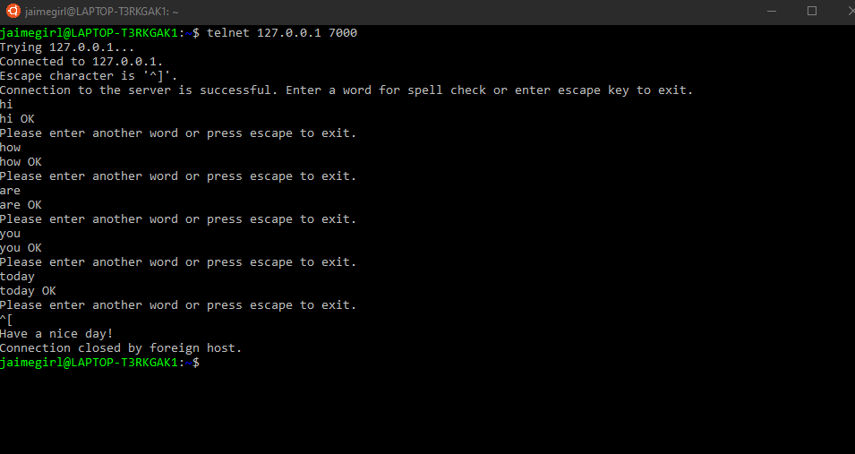
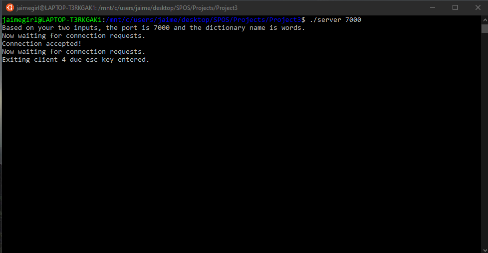

Jaime Riley: tuh06971 
CIS 3207 
Networked Spell Checker 

This program allows clients to connect to a server, input one word at a time the words they would like to get  
spell-checked, and the server will check a dictionary and tell the client whether the word is spelled correctly or not.  
The server will continue to expect words from a client until they enter the escape key and press return. The program  
that enables the Networked Spell Checker is multithreaded. The threads are the main thread, worker threads, and log thread.  
Therefore, multiple clients can access the server at once and no data will be lost or compromised. Each time a word is entered,  
the word is returned followed by either "OK" or "MISPELLED" based off whether the input was spelled correctly.    
When the server is ran using "./server", the person running the server can choose a port number and dictionary name that they want  
to be accessed. 

When the server first starts, this is what is seen on the server side:  
  

When a client connects to the server, they will see the following. See what happens when words and the esc key are entered.   

From the server end, this is what is happening:      

